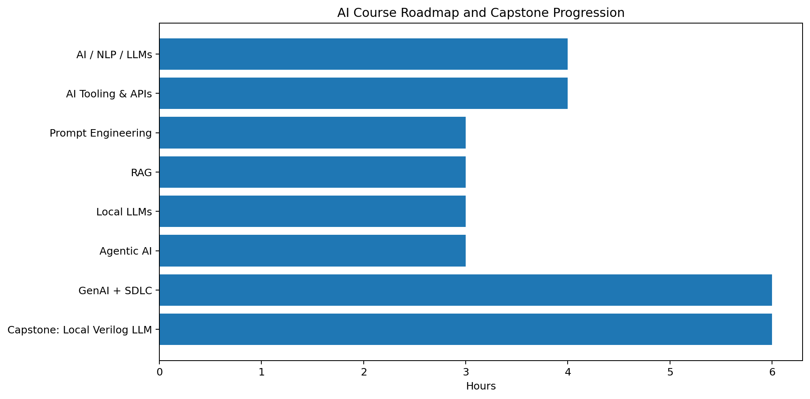
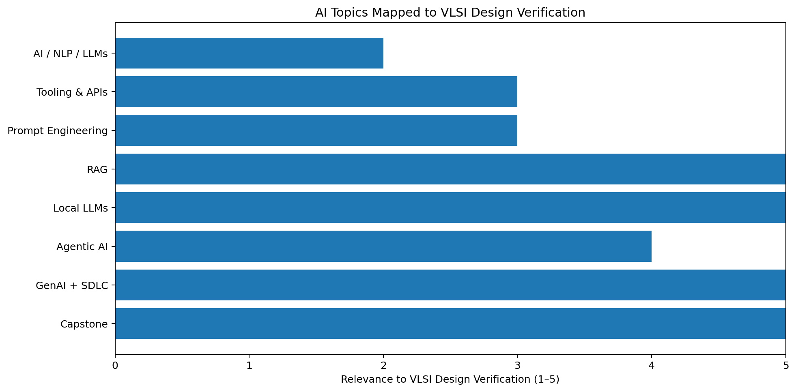
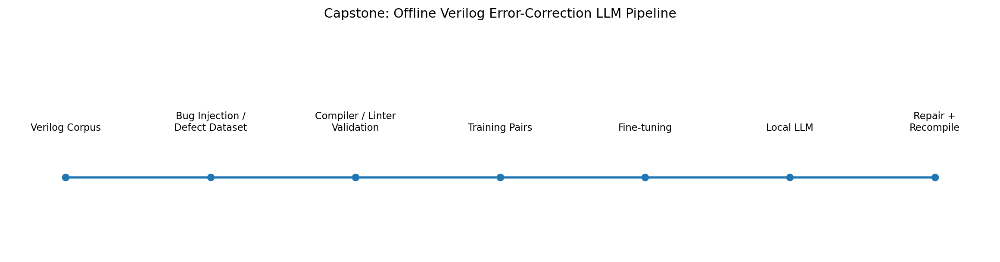

# AI → VLSI Design Verification Learning Roadmap & Capstone

> **Goal:** Connect an Applied Generative AI curriculum with **VLSI
> Design Verification**, and use the concepts to build the current
> capstone: an **offline/local LLM for Verilog error detection and
> correction**.



------------------------------------------------------------------------

## 1. Executive Summary

This repository documents the learning path from fundamental Generative
AI concepts to a practical hardware-design-oriented capstone.

The source course schedule is titled **"Introduction to Applied
Generative AI: From LLMs to Agentic AI"** and covers:

1.  Foundations of AI, NLP & Modern LLMs
2.  AI Tooling, APIs & GenAI Development Environment
3.  Prompt Engineering & Building GenAI Applications
4.  Enterprise GenAI Systems with RAG
5.  Local LLMs & AI Governance
6.  Introduction to Agentic AI
7.  GenAI in Software Development Life Cycle (SDLC)
8.  Capstone Project -- End-to-End Enterprise GenAI Solution

The schedule allocates 26 instructional hours across these topics,
including a 6-hour capstone-oriented session.

### Our adaptation

Instead of treating the curriculum as a generic software-AI course, we
map every topic to the **VLSI / RTL / Design Verification workflow**.

The current capstone is:

> **Design and develop an offline Verilog-aware LLM that can detect,
> explain, and correct common Verilog/RTL errors, with
> compiler/linter-based verification of the generated repair.**

------------------------------------------------------------------------

# 2. Why Generative AI Matters in VLSI Design Verification

Modern VLSI verification involves large amounts of:

-   Verilog/SystemVerilog RTL
-   UVM testbenches
-   assertions
-   coverage models
-   constraints
-   simulation logs
-   compiler/elaboration errors
-   waveform data
-   lint reports
-   synthesis reports
-   regression results
-   specifications and design documents

A verification engineer frequently performs a loop like:

``` text
RTL / Testbench
      |
      v
Compile / Elaborate
      |
      v
Error / Warning / Failure
      |
      v
Debug
      |
      v
Modify RTL / TB
      |
      v
Recompile / Simulate
      |
      +------ PASS ------> Regression
      |
      +------ FAIL ------> Debug again
```

A domain-specific local LLM can become an assistant inside this loop.

The important design principle is:

> **The LLM proposes the repair; deterministic EDA tools verify whether
> the repair actually works.**

This avoids treating an LLM response as ground truth.

------------------------------------------------------------------------

# 3. Course-to-VLSI Mapping



  -----------------------------------------------------------------------------
  Course topic      Core AI concept   VLSI / DV         Capstone connection
                                      connection        
  ----------------- ----------------- ----------------- -----------------------
  Foundations of    Transformers,     Understand how an Select a suitable base
  AI, NLP & LLMs    tokens, context,  LLM interprets    code model
                    hallucinations    RTL text          

  AI Tooling, APIs  SDKs, model       Automate          Prototype model
  & Development     parameters,       RTL-debug         interfaces before going
                    structured        workflows         offline
                    outputs                             

  Prompt            Zero-shot,        Give RTL, error   Design repair prompts
  Engineering       few-shot,         logs, constraints 
                    structured        and expected      
                    prompting         output            

  RAG               Embeddings,       Retrieve coding   Local Verilog knowledge
                    chunking, vector  rules, module     base
                    DBs               context, specs    
                                      and prior fixes   

  Local LLMs &      Ollama, local     Keep proprietary  Core offline inference
  Governance        models, privacy,  RTL off external  architecture
                    guardrails        services          

  Agentic AI        Tools, memory,    Compiler → LLM →  Automated repair agent
                    workflows         compiler feedback 
                                      loop              

  GenAI + SDLC      AI-assisted       RTL generation,   Verification-oriented
                    development and   testbench         AI workflow
                    testing           generation, debug 
                                      and QA            

  Capstone          End-to-end        Complete RTL      Local Verilog
                    solution          repair assistant  Error-Correction LLM
  -----------------------------------------------------------------------------

------------------------------------------------------------------------

# 4. Topic 1 --- Foundations of AI, NLP & Modern LLMs

## What is covered

The course introduces:

-   Evolution of AI
-   NLP
-   Transformer architecture
-   How LLMs work
-   GPT / Claude / Gemini / Llama
-   Tokens
-   Context windows
-   Hallucinations
-   Generative-AI use cases

## VLSI Design Verification relevance

Verilog and SystemVerilog are programming/hardware-description languages
represented as text.

Therefore, an LLM can process:

``` verilog
always_ff @(posedge clk) begin
    if (rst)
        q <= 1'b0;
    else
        q <= d;
end
```

as a sequence of tokens.

However, RTL has an additional requirement that ordinary text does not:

> **The generated code must obey HDL syntax and produce the intended
> hardware behavior.**

This creates a major difference between a normal coding assistant and a
VLSI-oriented assistant.

### Example

A general LLM may produce:

``` verilog
assign q = d;
```

when the specification actually requires a flip-flop.

A verification-aware system should reason about:

-   clocking
-   reset
-   sequential vs combinational logic
-   signal widths
-   blocking/non-blocking assignments
-   sensitivity
-   inferred hardware
-   functional behavior

### Key takeaway

**LLM knowledge is not enough. EDA-tool feedback is required.**

------------------------------------------------------------------------

# 5. Topic 2 --- AI Tooling, APIs & Development Environment

## Concepts

The curriculum covers:

-   Hugging Face Hub
-   Google Colab
-   LLM APIs
-   API authentication
-   SDKs
-   streaming
-   structured outputs
-   model parameters
-   token and cost management

## VLSI connection

The same concepts map naturally to automation around EDA tools.

For example:

``` text
Python Controller
       |
       +----> LLM
       |
       +----> Icarus Verilog
       |
       +----> Verilator
       |
       +----> Yosys
       |
       +----> Testbench / Regression
       |
       +----> Log Parser
```

Instead of manually copying an error into an AI assistant, Python can
collect:

``` text
RTL
+
compiler output
+
module context
+
repair history
```

and submit a structured request to the local model.

### Capstone application

During development, external APIs can be useful for experimentation.

For the final system, however, the target architecture is:

``` text
User RTL
   |
   v
Python application
   |
   v
Local inference runtime
   |
   v
Local model
```

No cloud inference is required during operation.

------------------------------------------------------------------------

# 6. Topic 3 --- Prompt Engineering & GenAI Applications

## Concepts

The course covers:

-   Prompt anatomy
-   Zero-shot prompting
-   Few-shot prompting
-   Role prompting
-   Prompt chaining
-   Structured outputs

## VLSI connection

A generic prompt:

``` text
Fix this code.
```

is insufficient for reliable RTL repair.

A better prompt can specify:

``` text
ROLE:
You are a Verilog/SystemVerilog RTL verification assistant.

TASK:
Identify the compilation error and propose the minimum safe correction.

INPUT:
1. RTL source
2. Compiler error
3. Relevant module/interface information

OUTPUT:
1. Error category
2. Explanation
3. Corrected RTL
4. Verification notes
```

### Few-shot example

The model can be shown:

``` text
BUGGY RTL
   |
   +--> Compiler error
   |
   +--> Correct RTL
```

before receiving a new problem.

This is particularly useful for specialized errors such as:

-   undeclared signals
-   incorrect module ports
-   width mismatches
-   syntax errors
-   invalid sensitivity lists
-   incorrect declarations

------------------------------------------------------------------------

# 7. Topic 4 --- RAG and Enterprise GenAI

## What is RAG?

Retrieval-Augmented Generation combines:

``` text
User query
    |
    v
Retriever
    |
    v
Relevant documents
    |
    v
LLM
    |
    v
Answer
```

The course specifically covers:

-   embeddings
-   chunking
-   vector databases
-   FAISS / ChromaDB
-   context retrieval

## VLSI application

A local RAG system can contain:

``` text
local_knowledge/
│
├── verilog_reference/
├── systemverilog_reference/
├── uvm_reference/
├── coding_guidelines/
├── project_specs/
├── previous_errors/
├── compiler_errors/
└── design_documents/
```

A query such as:

> Why is this always block failing lint?

could retrieve relevant:

-   SystemVerilog rules
-   project coding guidelines
-   similar previous errors
-   module context

before the LLM generates its response.

### Important distinction

RAG does **not** train the model.

``` text
Fine-tuning
    = changes model parameters

RAG
    = supplies relevant external context at inference time
```

Our capstone may eventually use both.

------------------------------------------------------------------------

# 8. Topic 5 --- Local LLMs & AI Governance

This topic is the **core technology for our current project**.

The course introduces:

-   open-source LLM ecosystem
-   Ollama
-   local models
-   privacy
-   security
-   responsible AI
-   governance
-   prompt-injection risks
-   guardrails

## Why local inference is valuable for VLSI

RTL can contain:

-   proprietary architecture
-   IP
-   register maps
-   internal interfaces
-   verification environments
-   confidential specifications

Sending such data to an external LLM may be undesirable.

A local model provides:

``` text
                 LOCAL MACHINE
┌─────────────────────────────────────┐
│                                     │
│  RTL ──> Local LLM ──> Fixed RTL   │
│          │                          │
│          ├── Local embeddings       │
│          ├── Local RAG              │
│          └── Local EDA tools        │
│                                     │
└─────────────────────────────────────┘
                 X
              Internet
```

The target is therefore:

> **Offline inference after the required models and software have been
> installed.**

------------------------------------------------------------------------

# 9. Topic 6 --- Agentic AI

Agentic AI becomes especially interesting for RTL debugging.

Instead of:

``` text
User → LLM → Answer
```

we can build:

``` text
                    ┌──────────────┐
                    │  User RTL    │
                    └──────┬───────┘
                           |
                           v
                    ┌──────────────┐
                    │ Local LLM    │
                    └──────┬───────┘
                           |
                    Proposed repair
                           |
                           v
                    ┌──────────────┐
                    │ EDA Compiler │
                    └──────┬───────┘
                           |
                    ┌──────┴───────┐
                    |              |
                  PASS            FAIL
                    |              |
                    v              v
                 Finish       Error feedback
                                   |
                                   v
                              Local LLM
```

This is a **tool-using repair agent**.

The LLM is not trusted blindly.

It gets feedback from deterministic tools.

------------------------------------------------------------------------

# 10. Topic 7 --- GenAI in the Software Development Life Cycle

The course connects GenAI with:

-   requirements
-   architecture
-   design assistance
-   code generation
-   unit testing
-   test generation
-   QA automation

## VLSI equivalent

  Software SDLC       VLSI / DV equivalent
  ------------------- -----------------------------
  Requirements        Design specification
  Architecture        RTL microarchitecture
  Code                Verilog/SystemVerilog
  Unit tests          RTL testbench
  Integration tests   SoC/subsystem verification
  Static analysis     RTL lint
  Compiler            HDL compilation/elaboration
  Runtime tests       Simulation
  Coverage            Functional/code coverage
  CI/CD               Regression
  Debug               Waveform/log analysis

This makes GenAI directly relevant to the verification lifecycle.

------------------------------------------------------------------------

# 11. Capstone Project --- Local Verilog Error-Correction LLM

## Project objective

Develop a local AI system that accepts defective Verilog/SystemVerilog
and produces a corrected version, while using deterministic HDL tools to
verify the generated repair.

### Primary objective

``` text
Broken Verilog
      +
Compiler/Linter Error
      |
      v
 Local Verilog LLM
      |
      v
Corrected Verilog
      |
      v
Compile / Simulate
      |
      v
PASS / FAIL
```

------------------------------------------------------------------------

# 12. Initial Dataset: VerilogBenchmark-Dataset

One of the starting datasets is:

**VerilogBenchmark-Dataset**

Repository:

`https://github.com/colagaga/VerilogBenchmark-Dataset`

It is useful because it contains defective Verilog examples organized
around static-analysis-oriented defect categories.

The dataset should be treated as a **seed/benchmark**, not the complete
training corpus.

### Why?

Our desired training task is:

``` text
Buggy Verilog
      ↓
Correct Verilog
```

whereas a benchmark may primarily provide:

``` text
Verilog
      ↓
Defect / analysis label
```

Therefore, the dataset needs to be transformed into repair-oriented
examples where a trustworthy corrected target is available.

------------------------------------------------------------------------

# 13. Additional Verilog AI Resources

## VerilogEval

NVIDIA's VerilogEval is an evaluation framework for LLM-based Verilog
generation. The current repository supports specification-to-RTL tasks
in addition to the original code-completion benchmark and categorizes
common Icarus Verilog failures.

Repository:

`https://github.com/NVlabs/verilog-eval`

This is valuable for **evaluation and general Verilog capability**, but
it is not identical to our error-repair task.

## RTLFixer

NVIDIA's RTLFixer is particularly relevant because it focuses on
automatically fixing RTL syntax errors using LLMs.

Repository:

`https://github.com/NVlabs/RTLFixer`

This provides a useful reference for designing our repair methodology.

## VerilogCoder

VerilogCoder explores an autonomous Verilog coding agent using
graph-based planning and AST/waveform tracing.

Repository:

`https://github.com/NVlabs/VerilogCoder`

This is relevant to the future agentic phase of our project.

------------------------------------------------------------------------

# 14. Dataset Strategy

A strong training corpus should contain several layers.

``` text
                    TRAINING CORPUS
                          |
        ┌─────────────────┼─────────────────┐
        |                 |                 |
        v                 v                 v
 Real Defects       Synthetic Defects   Clean RTL
        |                 |                 |
        v                 v                 v
 Benchmarks        Controlled mutation   General RTL
        |                 |                 |
        └─────────────────┼─────────────────┘
                          v
                  Repair Examples
                          |
                          v
                   Train / Validation
                          |
                          v
                         Test
```

### Dataset sources

### A. Real defective RTL

Use benchmark datasets containing actual defects.

### B. Synthetic defects

Start from valid RTL and introduce controlled errors.

Examples:

``` text
Correct:
assign y = a + b;

Synthetic defect:
assign y = a + bb;
```

or:

``` text
Correct:
always @(posedge clk)

Defect:
always @(posedge clkk)
```

or:

``` text
Correct:
module top(input clk, output q);

Defect:
module top(input clk, output qq);
```

### C. Clean RTL

Use clean Verilog/SystemVerilog to teach the model normal HDL syntax and
structure.

------------------------------------------------------------------------

# 15. Automated Dataset Generation

This is one of the most important parts of the project.

Instead of manually writing thousands of examples:

``` text
Correct RTL
    |
    v
Bug Injector
    |
    +-- syntax defect
    +-- identifier defect
    +-- width defect
    +-- port defect
    +-- declaration defect
    +-- sensitivity defect
    +-- assignment defect
    +-- structural defect
    |
    v
Buggy RTL
    |
    v
EDA validation
    |
    v
Error message
    |
    v
Training pair
```

The compiler/linter becomes a source of ground-truth feedback.

------------------------------------------------------------------------

# 16. Training Data Format

A practical JSONL representation can be:

``` json
{
  "instruction": "Find and correct the Verilog error.",
  "bug_type": "undeclared_signal",
  "buggy_code": "assign y = a + bb;",
  "error_message": "bb is not declared",
  "fixed_code": "assign y = a + b;",
  "explanation": "The signal bb is not declared. The intended signal is b."
}
```

A second representation can focus only on repair:

``` json
{
  "input": "RTL + compiler error",
  "output": "corrected RTL"
}
```

The final training format depends on the base model and fine-tuning
method.

------------------------------------------------------------------------

# 17. Error Taxonomy for the Capstone

The repair dataset should eventually cover categories such as:

### Syntax

-   missing semicolon
-   unmatched `begin/end`
-   malformed declarations
-   invalid operators

### Signal / Identifier

-   undeclared signal
-   misspelled signal
-   incorrect signal reference

### Width

-   assignment width mismatch
-   arithmetic width mismatch
-   concatenation width errors
-   signed/unsigned problems

### Module Interface

-   wrong port name
-   missing port
-   incorrect port direction
-   module instantiation mismatch

### Sequential Logic

-   incorrect sensitivity
-   blocking vs non-blocking misuse
-   reset handling

### Combinational Logic

-   incomplete assignments
-   unintended latch inference
-   incorrect `always_comb`

### Structural / RTL

-   incorrect module hierarchy
-   invalid connections
-   parameter misuse

### Tool-specific

-   compiler errors
-   elaboration failures
-   lint warnings
-   synthesis-related warnings

------------------------------------------------------------------------

# 18. VLSI Verification Feedback Loop

The core verification principle is:

``` text
          ┌───────────────────┐
          │ Buggy RTL         │
          └─────────┬─────────┘
                    |
                    v
          ┌───────────────────┐
          │ Local LLM         │
          │ Diagnosis + Fix   │
          └─────────┬─────────┘
                    |
                    v
          ┌───────────────────┐
          │ Compiler / Linter │
          └─────────┬─────────┘
                    |
             ┌──────┴──────┐
             |             |
            PASS          FAIL
             |             |
             v             v
         Candidate      Feedback
          accepted          |
                            v
                         LLM retry
```

For functional bugs, the loop can be extended:

``` text
Compile
  ↓
Elaborate
  ↓
Simulate
  ↓
Compare expected behavior
  ↓
Coverage
  ↓
PASS / FAIL
```

------------------------------------------------------------------------

# 19. Evaluation Metrics

We should not evaluate the project only using language-model metrics.

### AI-level metrics

-   Exact-match repair rate
-   Pass@1
-   Pass@k
-   Error classification accuracy
-   Explanation quality
-   Token usage
-   Inference latency

### HDL-level metrics

Most important:

> **Does the corrected RTL compile?**

Then:

-   syntax pass rate
-   elaboration pass rate
-   simulation pass rate
-   functional correctness
-   regression pass rate
-   synthesis success rate

### Verification-oriented metric

A particularly useful metric is:

``` text
Repair Success Rate
=
Repairs passing the required HDL verification
----------------------------------------------
Total repair attempts
```

This is more meaningful than asking whether the generated text resembles
the reference solution.

------------------------------------------------------------------------

# 20. Proposed Capstone Architecture



``` text
                       ┌──────────────────────┐
                       │     User / Engineer  │
                       └──────────┬───────────┘
                                  |
                                  v
                       ┌──────────────────────┐
                       │ Local Python App     │
                       └──────────┬───────────┘
                                  |
                ┌─────────────────┼──────────────────┐
                |                 |                  |
                v                 v                  v
          RTL Parser        Error Parser       RAG Retriever
                |                 |                  |
                └─────────────────┼──────────────────┘
                                  |
                                  v
                       ┌──────────────────────┐
                       │    Local LLM         │
                       │  Verilog-aware model │
                       └──────────┬───────────┘
                                  |
                                  v
                       ┌──────────────────────┐
                       │ Proposed RTL Repair  │
                       └──────────┬───────────┘
                                  |
                                  v
                       ┌──────────────────────┐
                       │ HDL Verification     │
                       │ Icarus / Verilator   │
                       │ Yosys / other EDA    │
                       └──────────┬───────────┘
                                  |
                       ┌──────────┴──────────┐
                       |                     |
                     PASS                   FAIL
                       |                     |
                       v                     v
                   Accept             Feedback → LLM
```

------------------------------------------------------------------------

# 21. Recommended Technology Stack

  Layer                 Initial choice
  --------------------- ---------------------------------
  Language              Python
  Local inference       Ollama / llama.cpp
  Base model            Small coding-capable open model
  Fine-tuning           LoRA / QLoRA
  Dataset               JSONL
  Embeddings            Local embedding model
  Vector DB             FAISS / ChromaDB
  HDL compilation       Icarus Verilog
  HDL simulation        Icarus / Verilator
  RTL synthesis check   Yosys
  Front end             CLI first
  Future UI             Local web application
  Version control       Git

The exact base model should be selected only after checking the
available CPU RAM/GPU VRAM.

------------------------------------------------------------------------

# 22. Development Phases

## Phase 1 --- Local LLM

Goal:

``` text
Python → Local Runtime → Model → Response
```

No cloud inference.

------------------------------------------------------------------------

## Phase 2 --- Verilog-aware prompting

Input:

``` text
Verilog
+
compiler error
```

Output:

``` text
diagnosis
+
corrected Verilog
```

------------------------------------------------------------------------

## Phase 3 --- Dataset construction

Build:

``` text
clean RTL
+
real defects
+
synthetic defects
+
compiler feedback
```

Then divide into:

``` text
Train
Validation
Test
```

------------------------------------------------------------------------

## Phase 4 --- Fine-tuning

Fine-tune a pretrained coding model using repair pairs.

Initial objective:

> Given defective Verilog and its error information, generate a
> corrected version.

------------------------------------------------------------------------

## Phase 5 --- Automated verification

Every generated repair is sent to:

``` text
Compiler
   ↓
Elaborator
   ↓
Simulator
   ↓
Optional synthesis
```

------------------------------------------------------------------------

## Phase 6 --- RAG

Add local:

-   Verilog references
-   SystemVerilog references
-   UVM references
-   coding guidelines
-   project documentation
-   previous verified repairs

------------------------------------------------------------------------

## Phase 7 --- Agentic repair

Allow the model to:

1.  inspect RTL
2.  run compiler
3.  read error
4.  propose repair
5.  compile again
6.  inspect new error
7.  iterate
8.  stop when verified

------------------------------------------------------------------------

# 23. Research / Project Contribution

The strongest contribution is not simply:

> "I ran a local LLM."

Instead, the project can demonstrate a complete **verification-aware
code-repair pipeline**:

``` text
                LOCAL LLM
                   +
             RTL knowledge
                   +
             Error feedback
                   +
             EDA validation
                   |
                   v
       Verified Verilog Repair
```

Potential contribution areas:

-   domain-specific Verilog repair dataset
-   automated RTL bug generation
-   compiler-guided repair
-   local/offline inference
-   RAG for RTL knowledge
-   agentic compiler-feedback loops
-   verification-aware evaluation metrics

------------------------------------------------------------------------

# 24. Important Design Principle

### Do not make the LLM the verification authority.

The LLM should be considered:

``` text
                 LLM
                  |
          proposes / explains
                  |
                  v
              EDA tools
                  |
             verifies result
```

This is analogous to a verification engineer using AI as a debugging
assistant rather than accepting AI output without checking it.

------------------------------------------------------------------------

# 25. Final Learning Map

``` text
AI Fundamentals
       |
       v
LLM Architecture
       |
       v
Prompt Engineering
       |
       v
RAG
       |
       v
Local LLM
       |
       v
Agentic AI
       |
       v
GenAI + SDLC
       |
       v
      VLSI
       |
       v
RTL / Verification
       |
       v
Compiler Feedback
       |
       v
Verilog Repair Dataset
       |
       v
Fine-tuned Local Model
       |
       v
Verified RTL Repair Agent
```

------------------------------------------------------------------------

# 26. Current Capstone Status

### Current project

**Offline / Local LLM for Verilog Error Detection and Correction**

### Current research direction

``` text
                ┌──────────────────────────┐
                │ Verilog Repair LLM       │
                └────────────┬─────────────┘
                             |
        ┌────────────────────┼───────────────────┐
        |                    |                   |
        v                    v                   v
   Dataset              Local Model          Verification
        |                    |                   |
        v                    v                   v
 Real + synthetic       Fine-tuning          Compiler /
    defects             + RAG               simulation
        |                    |                   |
        └────────────────────┴───────────────────┘
                             |
                             v
                  Verified RTL Correction
```

### Immediate next steps

-   [ ] Inspect `VerilogBenchmark-Dataset` files in detail.
-   [ ] Identify which examples contain sufficient information for
    repair targets.
-   [ ] Define the error taxonomy.
-   [ ] Collect clean Verilog/SystemVerilog samples.
-   [ ] Build a controlled Verilog bug injector.
-   [ ] Validate injected defects using HDL tools.
-   [ ] Create repair-oriented JSONL training pairs.
-   [ ] Check local machine RAM/VRAM.
-   [ ] Select a suitable base coding model.
-   [ ] Run the first completely local inference test.
-   [ ] Fine-tune only after the dataset and evaluation pipeline are
    stable.
-   [ ] Add RAG.
-   [ ] Add compiler-feedback iteration.
-   [ ] Evaluate using HDL pass/fail metrics.

------------------------------------------------------------------------

# 27. Success Criteria

The project should ultimately demonstrate:

``` text
             INPUT
               |
               v
       Broken Verilog RTL
               |
               v
        Local Verilog LLM
               |
               v
        Proposed correction
               |
               v
        HDL compilation
               |
        ┌──────┴──────┐
        |             |
       PASS          FAIL
        |             |
        v             v
    Correct RTL    Feedback loop
```

The final claim should therefore be measurable:

> **How often does the local model generate a repair that passes the
> required HDL verification checks?**

That is the metric that connects the AI project directly to **VLSI
Design Verification**.

------------------------------------------------------------------------

## References

1.  Course schedule: *Introduction to Applied Generative AI: From LLMs
    to Agentic AI*.
2.  VerilogBenchmark-Dataset --- `colagaga/VerilogBenchmark-Dataset`.
3.  NVIDIA VerilogEval --- `NVlabs/verilog-eval`.
4.  NVIDIA RTLFixer --- `NVlabs/RTLFixer`.
5.  NVIDIA VerilogCoder --- `NVlabs/VerilogCoder`.

------------------------------------------------------------------------

## Project Vision

> **Build a private, offline AI assistant for RTL engineers that does
> not merely generate Verilog, but uses EDA-tool feedback to diagnose,
> repair, and verify Verilog/SystemVerilog code.**

**AI → Local LLM → Verilog → EDA Verification → Verified RTL**
