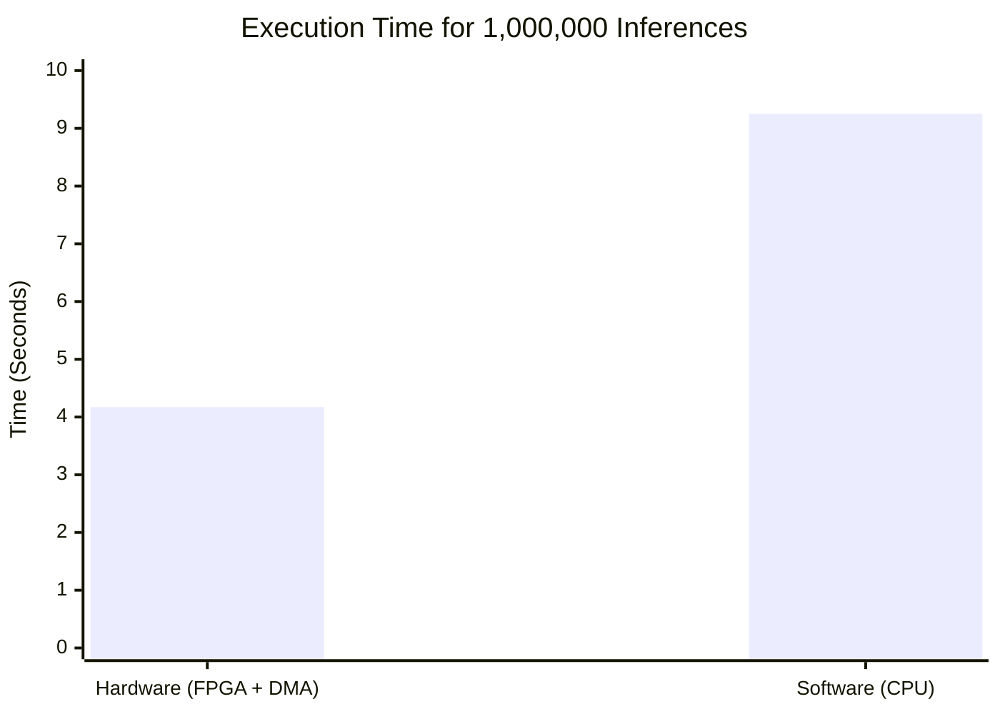

---

# Zynq FPGA Neural Network Accelerator via AXI DMA

This repository contains bare-metal C code for evaluating a hardware-accelerated Artificial Neural Network (ANN) running on a Xilinx Zynq FPGA. The project compares the performance and accuracy of a custom hardware IP (designed via Vivado HLS) against a purely software-based implementation running on the processing system (ARM Cortex-A9 / MicroBlaze).

Data transfer between the CPU and the FPGA accelerator is handled using the **AXI Direct Memory Access (DMA)** IP in Polling Mode.

## System Architecture

* **Software (CPU):** Executes bare-metal C code to package weights/inputs, manage cache coherency (`Xil_DCacheFlushRange`, `Xil_DCacheInvalidateRange`), and trigger DMA transfers.
* **Hardware (FPGA):** A custom neural network IP that consumes an input stream (Weights + Inputs), computes two dense layers with Sigmoid activation using 16-bit fixed-point arithmetic, and returns an output stream.
* **Interconnect:** AXI DMA configured for Simple Transfer Mode (Scatter-Gather disabled).

---

## Test 1: Performance & Accuracy Benchmark

The first test measures the execution time of 1,000,000 consecutive inferences on both the hardware accelerator and the CPU. It also compares the exact prediction outputs to observe quantization error.

### Execution Time Results

The FPGA accelerator achieved a **~2.2x speedup** over the CPU, even when factoring in the overhead of initiating DMA transfers and managing cache flushes for every single inference.

### Prediction Accuracy (Fixed-Point vs. Floating-Point)

The CPU calculates the Sigmoid activation using 32-bit floating-point math (`expf`), while the hardware utilizes optimized 16-bit fixed-point math (10 fractional bits). The comparison below highlights the minor quantization error introduced by the hardware, which trades a tiny fraction of accuracy for massive gains in speed and power efficiency.

| Node | Hardware Output (Fixed-Point) | Software Output (Float) | Error Margin |
| --- | --- | --- | --- |
| **Node 0** | 0.914062 | 0.922147 | ~ 0.008 |
| **Node 1** | 0.041992 | 0.046385 | ~ 0.004 |
| **Node 2** | 0.041992 | 0.046383 | ~ 0.004 |
| **Node 3** | 0.019531 | 0.021778 | ~ 0.002 |

---

## Test 2: Dataset & Stress Validation

Because fixed-point arithmetic is susceptible to overflow and underflow, a secondary validation test is included to feed edge-case data into the hardware IP.

This test iterates through a simulated dataset containing:

1. **Standard Inputs:** To verify normal operating behavior.
2. **All Zeros (`0x00000000`):** To check for underflow and verify baseline bias calculations.
3. **Maximum Positive Values (`0x7FFF7FFF`):** To stress-test the hardware accumulators and ensure saturation logic prevents catastrophic integer wrap-around (overflow).

*Refer to the `test_dataset` array in `main.c` to see how the edge cases are dynamically loaded into the DMA transmission buffer.*

---

## Repository Structure

* `src/main.c`: The primary application containing DMA initialization, cache management, and hardware benchmarking loops.
* `src/ann_math.h` / `src/ann_math.c`: Contains the software equivalent of the Neural Network (Matrix multiplication and Sigmoid activation) for baseline comparison.

## How to Run in Vitis

1. Export your hardware `.xsa` file from Vivado (Ensure your AXI DMA has **Scatter-Gather disabled**).
2. Create a new Application Project in Vitis and select your exported hardware platform.
3. Copy the files from this repository's `src` folder into the Vitis `src` folder.
4. **Important Build Setting:**
* Right-click the project -> `C/C++ Build Settings` -> `GCC Linker` -> `Libraries`. Add `m` to link the math library (required for `expf`).
* Set optimization to `-O2` or `-O3` to ensure a fair software benchmark.

5. Build the project and Run via the System Debugger.